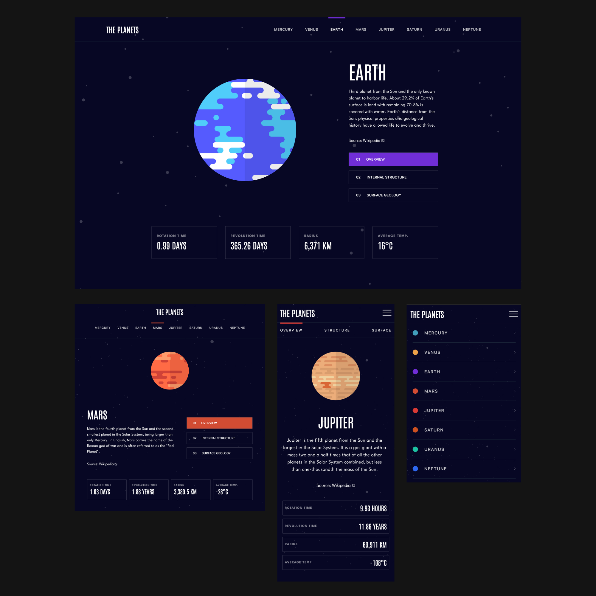

# Frontend Mentor - Planets fact site solution

This is a solution to the [Planets fact site challenge on Frontend Mentor](https://www.frontendmentor.io/challenges/planets-fact-site-gazqN8w_f). Frontend Mentor challenges help you improve your coding skills by building realistic projects.

## Table of contents

- [Overview](#overview)
  - [The challenge](#the-challenge)
  - [Screenshot](#screenshot)
  - [Links](#links)
- [My process](#my-process)
  - [Built with](#built-with)
  - [What I learned](#what-i-learned)
  - [Continued development](#continued-development)
  - [Useful resources](#useful-resources)
- [Author](#author)
- [Acknowledgments](#acknowledgments)

## Overview

This was an assignment from FrontEndMentor (https://www.frontendmentor.io/challenges/planets-fact-site-gazqN8w_f)

### The challenge

Users should be able to:

- View the optimal layout for the app depending on their device's screen size
- See hover states for all interactive elements on the page
- View each planet page and toggle between "Overview", "Internal Structure", and "Surface Geology"

### Screenshot

### Links

- Live Site URL: https://tomsplanetfacts.netlify.app/

## My process

### Built with

- Typescript
- React
- Vite
- Tailwind CSS

### What I learned

The beautiful design of this app jumped out at me the moment I saw it, and it had just enough tricky elements to make it the perfect challenge. It was fairly obvious that it would function best as an SPA, so I decided to go with a Typescript/React/Vite stack. Tailwind CSS has become a no-brainer for me when working in React since having stylings and markup in the same place makes a super smooth developer experience.

Considering the a number of page elements had to changed based on the current planet and section selected, it was clear I needed some kind of state management solution. Redux felt like overkill for a small app, so it looked into alternatives. The built-in Context API ( Zustand state management

Working with SVGs.
