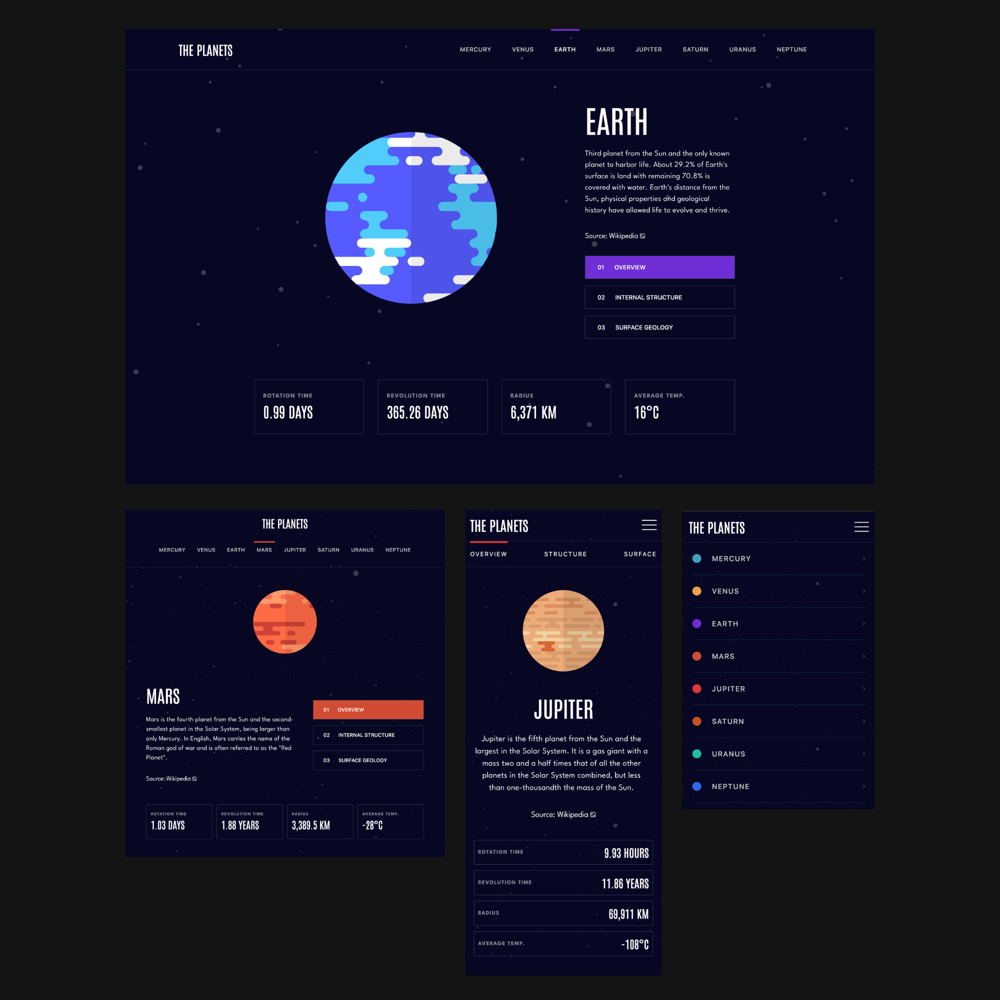

# Frontend Mentor - Planets fact site solution

This is a solution to the [Planets fact site challenge on Frontend Mentor](https://www.frontendmentor.io/challenges/planets-fact-site-gazqN8w_f). Frontend Mentor challenges help you improve your coding skills by building realistic projects.

## Table of contents

- [Overview](#overview)
  - [The challenge](#the-challenge)
  - [Screenshot](#screenshot)
  - [Links](#links)
- [My process](#my-process)
  - [Built with](#built-with)
  - [What I learned](#what-i-learned)

## Overview

This was an assignment from FrontEndMentor (https://www.frontendmentor.io/challenges/planets-fact-site-gazqN8w_f).

### The challenge

Users should be able to:

- View the optimal layout for the app depending on their device's screen size
- See hover states for all interactive elements on the page
- View each planet page and toggle between "Overview", "Internal Structure", and "Surface Geology"

### Screenshot

### Links

- Live Site URL: https://tomsplanetfacts.netlify.app/

## My process

### Built with

- Typescript
- React
- Vite
- Tailwind CSS

### What I learned

The beautiful design of this app jumped out at me the moment I saw it, and it had just enough tricky elements to make it the perfect challenge. It was fairly obvious that it would function best as an SPA, so I decided to go with a Typescript/React/Vite stack. Tailwind CSS has become a no-brainer for me when working in React since having stylings and markup in the same place makes for a super smooth developer experience.

Considering that a number of page elements had to be changed based on the current planet and section selected, it was clear I needed some kind of state management solution. Redux felt like overkill for a small app, so I looked into alternatives. The built-in Context API was my first thought, but after doing some research I came across Zustand, a new-ish state management library which sounded like the new standard for lightweight projects. True to its reputation, it was super easy to install, had almost no boilerplate, and apparently it has better performance than the context API.

I did have a few points where working with the planet SVGs became difficult, especially with resizing them so the planets would resize properly. Even though the default pixel sizes seemed to be set up so that they would render proportionally, I ended up having to give them static sizes using REMs adjusted at each device size so they would display correctly. I think there's probably a better approach and I'd like to revisit this later.

For a final touch, I added some animations with the background stars to make it appear like you're flying through space, and a small hover effect for the planet image. I had to do some research into keyframes to see how I could accomplish this, but once I got the hang of it, it was actually super easy to implement.
